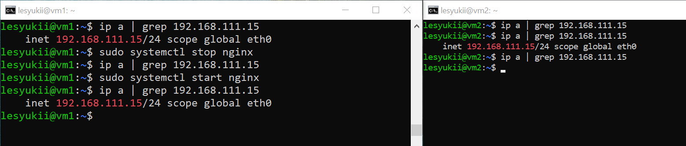

# Домашнее задание к занятию "`Disaster Recovery. FHRP и Keepalived`" - `Лесюк Иван`

---

### Задание 1

**Описание задания:**
Настроить отслеживание интерфейсов Gi0/0 для первой группы в схеме Cisco Packet Tracer. Проверить работоспособность через разрыв кабеля и выполнение команды ping между PC0 и Server0.

**Прикрепленные файлы:**
- [hsrp_advanced_lab.pkt](./hsrp_advanced_lab.pkt)

---

### Задание 2

**Описание задания:**
Настроить Keepalived на двух виртуальных машинах, реализовать мониторинг веб-сервера с помощью Bash-скрипта, который проверяет доступность порта и наличие файла `index.html`. В случае недоступности веб-сервера виртуальный IP должен переноситься на другую машину.

**Прикрепленные файлы:**
1. [check_web.sh](./check_web.sh) — Bash-скрипт для проверки доступности веб-сервера.
2. [keepalived_vm1.conf](./keepalived_vm1.conf) — конфигурационный файл Keepalived для Master.
3. [keepalived_vm2.conf](./keepalived_vm2.conf) — конфигурационный файл Keepalived для Backup.
4. Скриншот:  — демонстрация переезда виртуального IP.

---
